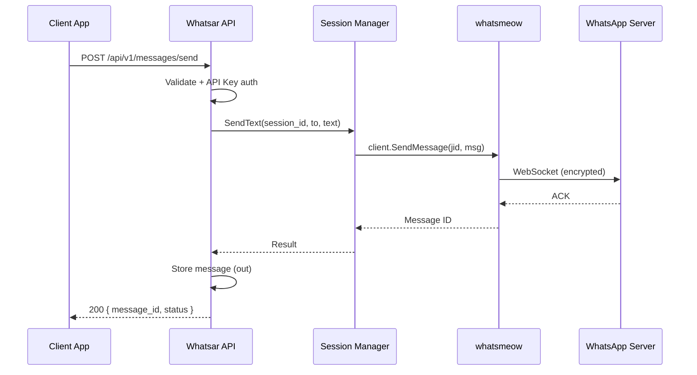
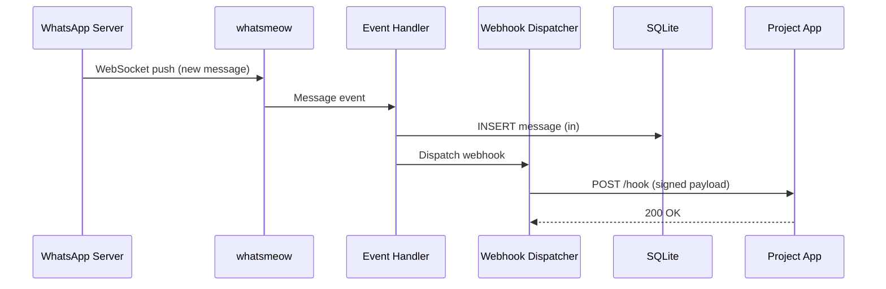

# Whatsar — Arsitektur Sistem

> Dokumen arsitektur untuk API WhatsApp ringan berbasis Go + whatsmeow, di-deploy di STB Armbian HG680P (2GB RAM, ARM).

---

## Ringkasan

Whatsar adalah **self-hosted WhatsApp API gateway** yang mengekspos protokol WhatsApp (via whatsmeow) sebagai REST API + admin UI. Dirancang untuk berjalan di hardware murah, diakses dari mana saja, dan dipakai ulang oleh banyak project.

```
┌──────────────┐     HTTPS       ┌─────────────────────────────────┐
│  Client App  │ ──────────────► │         STB Armbian (2GB)       │
│  (HP / PC /  │                 │  ┌─────────────────────────────┐ │
│   Laragon)   │ ◄────────────── │  │     Whatsar (Go binary)     │ │
└──────────────┘   JSON/HTML     │  │  ┌─────────┐  ┌──────────┐ │ │
                                  │  │  │ REST API│  │ Admin UI │ │ │
┌──────────────┐     HTTPS       │  │  │ (chi)   │  │ (HTMX)   │ │ │
│  Webhook     │ ◄────────────── │  │  └────┬────┘  └──────────┘ │ │
│  Receiver    │   POST event    │  │       │                    │ │
└──────────────┘                 │  │  ┌────▼────┐  ┌──────────┐ │ │
                                  │  │  │ Session │  │ SQLite   │ │ │
                                  │  │  │ Manager │  │   DB     │ │ │
                                  │  │  └────┬────┘  └──────────┘ │ │
                                  │  │       │                    │ │
                                  │  │  ┌────▼────┐               │ │
                                  │  │  │whatsmeow│               │ │
                                  │  │  │ engine  │               │ │
                                  │  │  └────┬────┘               │ │
                                  │  └───────┼────────────────────┘ │
                                  │          │ WebSocket (WSS)      │
                                  └──────────┼─────────────────────┘
                                             ▼
                                    ┌─────────────────┐
                                    │  WhatsApp Server │
                                    │  (Meta)          │
                                    └─────────────────┘
```

---

## Prinsip Desain

| Prinsip | Implementasi |
|---------|--------------|
| **Single process** | Satu binary Go: API + UI + engine wrapper |
| **Zero browser** | Tidak ada Chromium/Puppeteer — hemat RAM |
| **Embedded UI** | HTMX + CSS di-bundle via `go:embed` |
| **Stateless API** | State persisten di SQLite, bukan in-memory saja |
| **Thin client** | Project lain cuma HTTP — tidak perlu whatsmeow |
| **Graceful recovery** | Auto-reconnect + session restore dari DB |

---

## Komponen Utama

### 1. HTTP Server (`cmd/server` + `internal/api`)

Satu server Go melayani dua surface:

| Surface | Prefix | Konsumen |
|---------|--------|----------|
| REST API | `/api/v1/*` | Project eksternal (Laragon, bot, dll.) |
| Admin UI | `/admin/*` | Browser manusia (HP/laptop) |
| System | `/health` | Monitoring, Uptime Kuma, dll. |

**Router:** `go-chi/chi` — ringan, middleware-friendly.

**Middleware chain:**
```
Request
  → RequestID
  → Logger
  → Recoverer
  → [API routes] → APIKeyAuth → RateLimiter
  → [Admin routes] → SessionAuth (cookie/token sederhana)
  → Handler
```

---

### 2. Session Manager (`internal/wa`)

Mengelola lifecycle koneksi WhatsApp per nomor/session.

```
┌─────────────────────────────────────────────────────┐
│                  Session Manager                     │
│                                                      │
│  ┌──────────┐   ┌──────────┐   ┌──────────┐        │
│  │ Session A│   │ Session B│   │ Session C│  ...  │
│  │ (WA #1)  │   │ (WA #2)  │   │ (idle)   │        │
│  └────┬─────┘   └────┬─────┘   └──────────┘        │
│       │              │                               │
│       ▼              ▼                               │
│  whatsmeow.Client  whatsmeow.Client                  │
│  (goroutine)       (goroutine)                       │
└─────────────────────────────────────────────────────┘
```

**State machine per session:**

```
  ┌─────────┐   QR generated   ┌──────────┐
  │ CREATED │ ───────────────► │ QR_READY │
  └─────────┘                  └────┬─────┘
                                    │ scanned
                                    ▼
                               ┌───────────┐
                               │ CONNECTING│
                               └─────┬─────┘
                                     │ success
                                     ▼
  ┌──────────┐  disconnect   ┌───────────┐   reconnect   ┌───────────┐
  │  FAILED  │ ◄──────────── │ CONNECTED │ ─────────────►│ RECONNECT │
  └──────────┘               └───────────┘               └───────────┘
       │                           │
       │ max retry                 │ logout / delete
       ▼                           ▼
  ┌──────────┐               ┌───────────┐
  │ STOPPED  │               │ DESTROYED │
  └──────────┘               └───────────┘
```

**Tanggung jawab:**
- Buat/hapus `whatsmeow.Client` per session
- Simpan & restore credential dari SQLite
- Generate & serve QR code
- Dispatch event (pesan masuk, status, disconnect)
- Auto-reconnect dengan backoff

---

### 3. WhatsApp Engine (`whatsmeow`)

Library pihak ketiga yang menangani protokol WhatsApp Multi-Device.

| Aspek | Detail |
|-------|--------|
| Protokol | WebSocket ke server WhatsApp |
| Enkripsi | Signal Protocol (ditangani whatsmeow) |
| Auth | QR pairing → credential disimpan lokal |
| Dependency | Hanya library Go — tidak perlu runtime lain |

Whatsar **tidak** mengimplementasi protokol sendiri — hanya wrapper tipis di atasnya.

---

### 4. Storage Layer (`internal/store`)

**Database:** SQLite dengan WAL mode.

```sql
-- sessions: metadata session WA
CREATE TABLE sessions (
    id          TEXT PRIMARY KEY,
    name        TEXT NOT NULL,
    phone       TEXT,
    status      TEXT NOT NULL DEFAULT 'created',
    created_at  DATETIME DEFAULT CURRENT_TIMESTAMP,
    updated_at  DATETIME DEFAULT CURRENT_TIMESTAMP
);

-- wa_credentials: device identity (whatsmeow store)
-- Disimpan terpisah, dienkripsi at-rest (opsional fase 6)

-- messages: log pesan masuk/keluar
CREATE TABLE messages (
    id          TEXT PRIMARY KEY,
    session_id  TEXT NOT NULL REFERENCES sessions(id),
    direction   TEXT NOT NULL,  -- 'in' | 'out'
    remote_jid  TEXT NOT NULL,
    body        TEXT,
    media_url   TEXT,
    wa_msg_id   TEXT,
    status      TEXT DEFAULT 'sent',
    created_at  DATETIME DEFAULT CURRENT_TIMESTAMP
);

-- webhooks: URL pendaftaran per client
CREATE TABLE webhooks (
    id          TEXT PRIMARY KEY,
    session_id  TEXT REFERENCES sessions(id),
    url         TEXT NOT NULL,
    events      TEXT NOT NULL,  -- JSON array: ["message.in","message.status"]
    secret      TEXT,
    active      INTEGER DEFAULT 1,
    created_at  DATETIME DEFAULT CURRENT_TIMESTAMP
);

-- api_keys: autentikasi client
CREATE TABLE api_keys (
    id          TEXT PRIMARY KEY,
    key_hash    TEXT NOT NULL,
    label       TEXT,
    active      INTEGER DEFAULT 1,
    created_at  DATETIME DEFAULT CURRENT_TIMESTAMP
);
```

**Kenapa SQLite?**
- Zero config, satu file
- RAM ~10–50 MB vs MySQL ~300+ MB
- Cukup untuk single-node STB
- WAL mode: read/write concurrent aman

---

### 5. Webhook Dispatcher (`internal/webhook`)

Saat pesan masuk dari WhatsApp, dispatcher mengirim HTTP POST ke URL yang terdaftar.

```
WhatsApp event
      │
      ▼
Event Handler (internal/wa/events.go)
      │
      ├──► Simpan ke messages table
      │
      └──► Webhook Dispatcher
                │
                ├── POST https://project-a.com/hook  (retry 3x)
                └── POST https://project-b.com/hook  (retry 3x)
```

**Payload webhook:**
```json
{
  "event": "message.in",
  "session_id": "default",
  "timestamp": "2026-06-16T10:00:00Z",
  "data": {
    "from": "628123456789@s.whatsapp.net",
    "body": "Halo!",
    "message_id": "ABC123",
    "type": "text"
  }
}
```

**Signature header:** `X-Whatsar-Signature: hmac-sha256(payload, secret)`

---

### 6. Admin UI (`web/templates` + `web/static`)

UI server-rendered dengan HTMX — bukan SPA.

| Halaman | Interaksi HTMX |
|---------|----------------|
| Dashboard | `hx-get` polling status session setiap 5s |
| QR Page | `hx-get` refresh QR image setiap 3s |
| Messages | `hx-get` load more, filter |
| Send test | `hx-post` kirim pesan tanpa reload |

**Alur render:**
```
Browser GET /admin
      │
      ▼
Go html/template → render HTML + HTMX attributes
      │
      ▼
Browser → HTMX request ke /admin/partials/...
      │
      ▼
Go handler → return HTML fragment (bukan JSON)
      │
      ▼
HTMX swap DOM
```

Tidak ada build step frontend di STB. File statis di-embed saat compile.

---

## Alur Data

### Kirim Pesan (Client → WhatsApp)

```
Client App
  │ POST /api/v1/messages/send
  │ Headers: X-API-Key
  │ Body: { session_id, to, text }
  ▼
API Handler
  │ validate input + auth
  ▼
Session Manager
  │ get active whatsmeow client
  ▼
whatsmeow.Client.SendMessage()
  │ encrypt + send via WebSocket
  ▼
WhatsApp Server → Penerima
  │
  ▼ (parallel)
Store → INSERT messages (direction: out)
```

### Terima Pesan (WhatsApp → Client)

```
WhatsApp Server
  │ WebSocket push
  ▼
whatsmeow event loop
  │ Message event
  ▼
Event Handler
  ├── Store → INSERT messages (direction: in)
  └── Webhook Dispatcher
        │ POST ke URL terdaftar
        ▼
      Client App (project Laragon, dll.)
```

### Pairing QR (Admin → WhatsApp)

```
Browser GET /admin/sessions/new
  ▼
Admin Handler → Session Manager.Create()
  ▼
whatsmeow → generate QR channel
  ▼
Render template dengan 
  │
  │ HTMX polling setiap 3s
  ▼
GET /admin/sessions/{id}/status
  │ status == "connected" → redirect ke dashboard
  ▼
Credential disimpan ke SQLite → session aktif
```

---

## Instalasi via Bash (`install.sh`)

Project dipublish ke GitHub dengan installer universal — satu command, deteksi sistem otomatis.

### Cara install

```bash
# Install dasar (STB / VPS)
curl -fsSL https://raw.githubusercontent.com/<user>/whatsar/main/install.sh | sudo bash

# Dengan swap + Cloudflare Tunnel
curl -fsSL https://raw.githubusercontent.com/<user>/whatsar/main/install.sh | sudo bash -s -- --with-swap --with-tunnel
```

### Yang dideteksi otomatis

| Deteksi | Dipakai untuk |
|---------|---------------|
| OS (`/etc/os-release`) | Pilih package manager (apt/apk) |
| Arch (`uname -m`) | Download binary: `amd64`, `arm64`, `armv7` |
| RAM (`/proc/meminfo`) | Auto-saran swap jika ≤ 2GB |
| systemd | Buat & enable service |

### Alur installer

```
install.sh
    │
    ├── detect_os()      → debian / alpine / rhel
    ├── detect_arch()    → amd64 / arm64 / armv7
    ├── detect_ram()     → auto --with-swap jika kentang
    │
    ├── install_deps()   → curl, ca-certificates
    ├── setup_user()     → user whatsar (system)
    ├── setup_dirs()     → /opt/whatsar/{data,logs,config}
    ├── download_binary()→ GitHub Releases (per arch)
    ├── generate_config()→ config.yaml + API key random
    ├── setup_swap()     → 512MB (opsional)
    ├── setup_systemd()  → whatsar.service
    ├── setup_cloudflared() → opsional
    └── print_summary()  → URL, API key, admin pass
```

### GitHub Releases (multi-arch)

CI build 3 binary per release:

| Asset | Platform |
|-------|----------|
| `whatsar_vX.X.X_linux_amd64.tar.gz` | VPS x86, PC |
| `whatsar_vX.X.X_linux_arm64.tar.gz` | STB HG680P, RPi 4, Oracle ARM |
| `whatsar_vX.X.X_linux_armv7.tar.gz` | RPi 3, STB lama |

Installer cuma download binary yang cocok — **tidak perlu Go di server target**.

### Windows (`install.ps1`)

| Aspek | Detail |
|-------|--------|
| Runtime | Native Windows — `whatsar.exe`, tanpa WSL |
| Installer | PowerShell (`install.ps1`), bukan bash |
| Service | Windows Service (`Whatsar`) via `New-Service` |
| Arch | `amd64`, `arm64` (Windows on ARM) |
| Path default | `C:\whatsar\` |
| Dev lokal | Cocok buat develop di Laragon |

```powershell
# Install (Admin PowerShell)
irm https://raw.githubusercontent.com/<user>/whatsar/main/install.ps1 | iex

# Atau manual dev tanpa install
go run ./cmd/server
```

**Catatan Windows:**
- `install.sh` **tidak** jalan di CMD/PowerShell biasa (butuh WSL/Git Bash, tidak direkomendasikan)
- Production tetap disarankan **Linux** (lebih stabil 24/7)
- Windows ideal untuk **development** di mesin Laragon kamu

GitHub Release tambahan: `whatsar_vX.X.X_windows_amd64.zip`

---

## Deployment Architecture

```
Internet
    │
    ▼
┌───────────────────┐
│  Cloudflare Edge  │
│  (DNS + Tunnel)   │
└────────┬──────────┘
         │ outbound tunnel (no open port)
         ▼
┌────────────────────────────────────────┐
│  STB Armbian HG680P                    │
│  IP lokal: 192.168.x.x                 │
│                                        │
│  systemd: cloudflared.service          │
│      └── tunnel → localhost:8080       │
│                                        │
│  systemd: whatsar.service              │
│      └── /opt/whatsar/whatsar          │
│          ├── port 8080                 │
│          ├── /opt/whatsar/data/        │
│          │     └── whatsar.db        │
│          └── /opt/whatsar/config.yaml  │
│                                        │
│  swap: 512MB–1GB                       │
│  RAM usage: ~400–700MB (1 session)     │
└────────────────────────────────────────┘
```

**Kenapa Cloudflare Tunnel?**
- STB di belakang NAT/router — tidak perlu port forwarding
- HTTPS gratis otomatis
- `cloudflared` ringan (~30–50 MB RAM)
- Bisa tambah Access policy (opsional)

---

## Keamanan

| Layer | Mekanisme |
|-------|-----------|
| API eksternal | API Key (`X-API-Key` header), hash disimpan di DB |
| Admin UI | Session cookie + password (env config) |
| Webhook | HMAC signature verification |
| Transport | HTTPS via Cloudflare Tunnel |
| Credential WA | File SQLite, permission 600, path di luar web root |
| Rate limit | Per API key: 60 req/menit (configurable) |

**Yang TIDAK diekspos ke publik:**
- QR credential mentah
- SQLite file
- whatsmeow internal state

---

## Skalabilitas & Batasan

### Single Node (STB) — Desain Saat Ini

| Resource | Limit aman |
|----------|------------|
| Session aktif | 1–3 |
| Pesan/detik | ~5–10 |
| Concurrent API request | ~20 |
| Ukuran media | < 5 MB |
| Webhook target | < 10 URL |

### Scale Up (Masa Depan, Jika Perlu)

```
                    ┌─────────────┐
                    │  CF Tunnel  │
                    └──────┬──────┘
                           │
              ┌────────────▼────────────┐
              │   Whatsar API (stateless)│  ← VPS 2GB
              │   Tanpa whatsmeow        │
              └────────────┬────────────┘
                           │ gRPC / HTTP
              ┌────────────▼────────────┐
              │   WA Worker Node(s)       │  ← STB / VPS per session
              │   whatsmeow engine only   │
              └─────────────────────────┘
```

Arsitektur saat ini **monolith single-node** — cukup untuk personal use. Split API/Worker hanya jika session > 3 atau butuh HA.

---

## Dependency Map

```
whatsar (main)
├── go.mau.fi/whatsmeow          # WA protocol engine
├── go.mau.fi/util               # whatsmeow utilities
├── github.com/go-chi/chi        # HTTP router
├── modernc.org/sqlite           # SQLite driver (pure Go, ARM-friendly)
├── github.com/google/uuid       # ID generation
├── github.com/joho/godotenv     # .env loader (dev only)
└── golang.org/x/crypto          # API key hashing, HMAC
```

**Tidak ada dependency:**
- Node.js / npm
- Chromium / Puppeteer
- MySQL / PostgreSQL / Redis
- Docker (opsional, tidak wajib di STB)

---

## Monitoring & Observability

| Aspek | Solusi ringan |
|-------|---------------|
| Health | `GET /health` → `{ status, sessions, uptime }` |
| Log | Structured JSON ke stdout → systemd journal |
| Uptime | Uptime Kuma / CF health check ping `/health` |
| RAM | Cron script cek `free -m`, alert jika > 85% |
| WA disconnect | Webhook event `session.disconnected` + auto-reconnect log |

Tidak pakai Prometheus/Grafana di STB — terlalu berat.

---

## Failure Modes & Recovery

| Failure | Deteksi | Recovery |
|---------|---------|----------|
| WA WebSocket putus | whatsmeow disconnect event | Auto-reconnect, backoff 5s→60s |
| STB reboot | systemd start | Restore session dari SQLite credential |
| SQLite corrupt | query error | Backup harian, restore dari copy |
| RAM OOM | process killed | systemd Restart=on-failure, limit max session |
| whatsmeow breaking update | send/recv error | Pin version, test sebelum update |
| CF Tunnel down | health check fail | systemd restart cloudflared |

---

## Diagram Sequence — Kirim Pesan



---

## Diagram Sequence — Terima Pesan + Webhook



---

## Kesimpulan Arsitektur

| Keputusan | Pilihan | Alasan |
|-----------|---------|--------|
| Bahasa | Go | Single binary, ARM, hemat RAM |
| WA engine | whatsmeow | Paling ringan, tanpa browser |
| DB | SQLite | Zero config, hemat RAM |
| UI | HTMX + Pico | No JS build, embed di Go |
| Networking | CF Tunnel | Akses luar tanpa buka port |
| Arsitektur | Monolith single-node | Cukup untuk STB personal |

Lihat `PLAN.md` untuk urutan implementasi step-by-step.